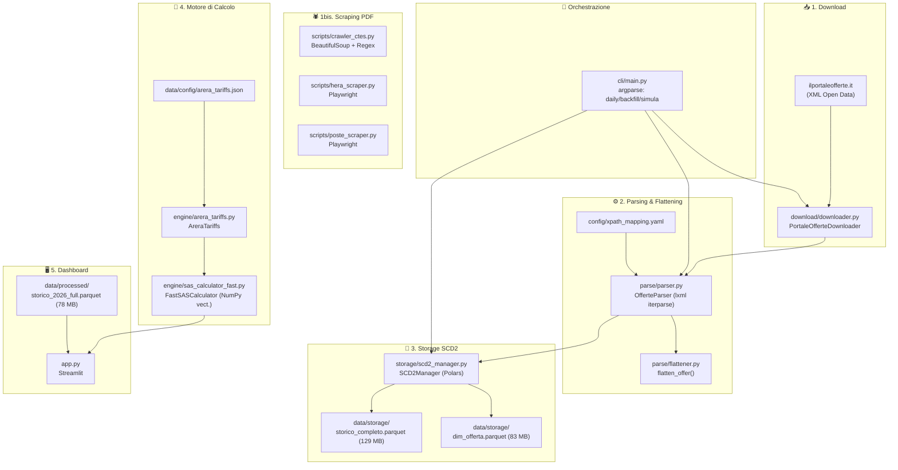

# 📋 Resoconto Completo del Progetto PO_scraping_2026

> **Progetto:** Motore di Intelligenza Offerte Luce e Gas — ENGIE Italia  
> **Data:** 25 Agosto 2026  
> **Stato:** Operativo con aree di sviluppo in corso

---

## 1. Visione d'Insieme

Il progetto **PO_scraping_2026** è un sistema end-to-end di **competitive intelligence** per il mercato Energy retail italiano (Luce e Gas). Automatizza l'intero ciclo:

1. **Download** dei file XML ufficiali dal Portale Offerte di Acquirente Unico
2. **Scraping** di PDF (CTE e Schede Sintetiche) dai siti dei 18 principali concorrenti
3. **Parsing e Flattening** degli XML complessi in tabelle denormalizzate
4. **Storicizzazione SCD2** con tracking delle variazioni giornaliere
5. **Calcolo della Spesa Annua Stimata (SAS)** secondo le regole ARERA
6. **Dashboard interattiva** Streamlit che simula esattamente il Portale Offerte ufficiale con funzionalità di Time Travel

---

## 2. Architettura del Sistema



---

## 3. Struttura del Progetto (File per File)

### 3.1 Core Pipeline ETL

| File | Dimensione | Ruolo |
|------|-----------|-------|
| [`downloader.py`](file:///c:/Users/XP6566/OneDrive%20-%20ENGIE/Documenti/PO_scraping_2026/download/downloader.py) | 2.6 KB | Scarica XML giornalieri dal Portale Offerte via HTTPX con retry esponenziale (5 tentativi). Salva in `.gz` partizionato per commodity/anno/mese |
| [`parser.py`](file:///c:/Users/XP6566/OneDrive%20-%20ENGIE/Documenti/PO_scraping_2026/parse/parser.py) | 1.4 KB | Parser XML in streaming (`lxml.iterparse`) con supporto gzip nativo. Zero footprint in RAM |
| [`flattener.py`](file:///c:/Users/XP6566/OneDrive%20-%20ENGIE/Documenti/PO_scraping_2026/parse/flattener.py) | 15 KB | Appiattisce i nodi XML gerarchici del SII/AU in record tabellari. Include dizionari di transcodifica per 15+ campi categorici (TIPO_MERCATO, FASCIA_COMPONENTE, UNITA_MISURA, ecc.). Estrae fino a 5 ComponenteImpresa × 5 IntervalloPrezzi e 15 Sconti × 2 PrezziSconto |
| [`scd2_manager.py`](file:///c:/Users/XP6566/OneDrive%20-%20ENGIE/Documenti/PO_scraping_2026/storage/scd2_manager.py) | 6.4 KB | Implementazione SCD Type 2 completa in Polars: identifica record Nuovi, Invariati (incrementa `n_giorni_pubblicazione`), Modificati (chiude vecchio, apre nuovo), e Cessati. Hash SHA-256 per change detection. Write atomico via temp file |
| [`schema.py`](file:///c:/Users/XP6566/OneDrive%20-%20ENGIE/Documenti/PO_scraping_2026/model/schema.py) | 967 B | Schema Polars formale per `dim_offerta.parquet` con surrogate keys e tracking columns |

### 3.2 Motore di Calcolo SAS

| File | Dimensione | Ruolo |
|------|-----------|-------|
| [`sas_calculator_fast.py`](file:///c:/Users/XP6566/OneDrive%20-%20ENGIE/Documenti/PO_scraping_2026/engine/sas_calculator_fast.py) | 14.7 KB | **Cuore del progetto.** Calcolo vettorizzato NumPy della Spesa Annua Stimata. Gestisce: componenti fisse/volumetriche per fascia (F1/F2/F3/F2+F3), perdite di rete (×1.10), sconti condizionali (SDD, Dual Fuel, validità), dispacciamento (CdispD), tariffe regolate ARERA, accise a scaglioni (EE e Gas), addizionali regionali, IVA differenziata (10%/22%) |
| [`sas_calculator.py`](file:///c:/Users/XP6566/OneDrive%20-%20ENGIE/Documenti/PO_scraping_2026/engine/sas_calculator.py) | 13.2 KB | Versione di riferimento row-by-row del calcolatore SAS. Blueprint per la versione fast |
| [`arera_tariffs.py`](file:///c:/Users/XP6566/OneDrive%20-%20ENGIE/Documenti/PO_scraping_2026/engine/arera_tariffs.py) | 6.5 KB | Caricatore e validatore delle tariffe regolate ARERA. Legge `arera_tariffs.json`, valida l'aggiornamento trimestrale (hard stop se obsolete), calcola accise Gas a scaglioni, mapping regione→zona tariffaria per le 6 zone Gas italiane |
| [`engine.py`](file:///c:/Users/XP6566/OneDrive%20-%20ENGIE/Documenti/PO_scraping_2026/pricing/engine.py) | 2.7 KB | PricingEngine con parametri regolatori time-bracketed via YAML. Struttura pronta per indicatori ICF/IC/IP. **⚠️ Contiene TODO: implementazione albero di calcolo ancora incompleta** |

### 3.3 Dashboard Streamlit

| File | Dimensione | Ruolo |
|------|-----------|-------|
| [`app.py`](file:///c:/Users/XP6566/OneDrive%20-%20ENGIE/Documenti/PO_scraping_2026/app.py) | 15.7 KB | App multi-step: (1) scelta commodity, (2) parametri fornitura (regione, residenza, potenza, fasce, tipo prezzo), (3) ranking con calcolo SAS live. Query DuckDB su Parquet con Time Travel. Vista doppia: HTML cards (simulazione Portale Offerte) + tabella dati. 4 tab per benchmark consumi (ARERA 2700 kWh, ENGIE 2100 kWh, 2 slot custom). Evidenziazione ENGIE in azzurro |

### 3.4 Scraping PDF Concorrenti (Fase 1)

| File | Dimensione | Ruolo |
|------|-----------|-------|
| [`crawler_ctes.py`](file:///c:/Users/XP6566/OneDrive%20-%20ENGIE/Documenti/PO_scraping_2026/scripts/crawler_ctes.py) | 7.1 KB | Crawler principale BS4+Regex: 2 livelli (index→offerta→PDF). Gestisce link Salesforce (A2A), AEM (ACEA), Web Components (E.ON), DAM offuscato (Edison), e semantica assente (Iren). Dedup via SHA-256, organizza in CTE/SS |
| [`hera_scraper.py`](file:///c:/Users/XP6566/OneDrive%20-%20ENGIE/Documenti/PO_scraping_2026/scripts/hera_scraper.py) | 3.6 KB | Bot Playwright per portale Liferay di Hera Comm (DOM reidratato JS) |
| [`poste_scraper.py`](file:///c:/Users/XP6566/OneDrive%20-%20ENGIE/Documenti/PO_scraping_2026/scripts/poste_scraper.py) | 3.0 KB | Bot Playwright per Poste Italiane (hosting multi-dominio, media.poste.it) |

### 3.5 Script Operativi

| File | Dimensione | Ruolo |
|------|-----------|-------|
| [`run_pipeline.py`](file:///c:/Users/XP6566/OneDrive%20-%20ENGIE/Documenti/PO_scraping_2026/scripts/run_pipeline.py) | 2.2 KB | Pipeline giornaliera completa: Download → Parse → SCD2 per E/G/D |
| [`update_daily.py`](file:///c:/Users/XP6566/OneDrive%20-%20ENGIE/Documenti/PO_scraping_2026/scripts/update_daily.py) | 4.1 KB | Aggiornamento incrementale dello storico Parquet con gap-filling automatico |
| [`build_lake.py`](file:///c:/Users/XP6566/OneDrive%20-%20ENGIE/Documenti/PO_scraping_2026/scripts/build_lake.py) | 2.9 KB | Costruisce il data lake da tutti i file .gz storici. Batch da 100 file per gestione RAM |
| [`rank_sas_full.py`](file:///c:/Users/XP6566/OneDrive%20-%20ENGIE/Documenti/PO_scraping_2026/scripts/rank_sas_full.py) | 5.4 KB | Script standalone di ranking SAS con calcolo dettagliato row-by-row |

### 3.6 Configurazione

| File | Ruolo |
|------|-------|
| [`arera_tariffs.json`](file:///c:/Users/XP6566/OneDrive%20-%20ENGIE/Documenti/PO_scraping_2026/data/config/arera_tariffs.json) | Tariffe regolate ARERA correnti (ELE residente/non residente, GAS 6 zone, accise, addizionali) |
| [`config_competitors.json`](file:///c:/Users/XP6566/OneDrive%20-%20ENGIE/Documenti/PO_scraping_2026/data/config/config_competitors.json) | URL di partenza per i 18 fornitori da scrapare |
| [`pricing_params.yaml`](file:///c:/Users/XP6566/OneDrive%20-%20ENGIE/Documenti/PO_scraping_2026/config/pricing_params.yaml) | Parametri regolatori time-bracketed (perdite, tutele graduali) |
| [`xpath_mapping.yaml`](file:///c:/Users/XP6566/OneDrive%20-%20ENGIE/Documenti/PO_scraping_2026/config/xpath_mapping.yaml) | Mapping namespace XML Acquirente Unico → campi target |

### 3.7 Dati Generati

| Percorso | Dimensione | Contenuto |
|----------|-----------|-----------|
| `data/storage/dim_offerta.parquet` | 83 MB | Dimensione SCD2 con storicizzazione versioni |
| `data/storage/storico_completo.parquet` | 129 MB | Archivio flat completo con DATA_RILEVAZIONE |
| `data/processed/storico_2026_full.parquet` | 78 MB | Snapshot processato per la dashboard |
| `data/processed/storico_2026.parquet` | 18 MB | Versione ridotta |

---

## 4. Stack Tecnologico

| Livello | Tecnologie |
|---------|------------|
| **Scraping HTML** | `requests`, `beautifulsoup4`, Regex |
| **Scraping JS** | `playwright` (Chromium headless) |
| **XML Parsing** | `lxml` (iterparse streaming) |
| **Estrazione AI (Fase 2)** | Google Gemini 2.5 Flash (`google-genai`) |
| **Data Processing** | `polars`, `pandas`, `numpy`, `pyarrow` |
| **Query Engine** | `duckdb` (in-process SQL su Parquet) |
| **Dashboard** | `streamlit` |
| **Storage** | Parquet (SCD Type 2) |
| **Validazione** | `pydantic` |
| **HTTP Client** | `httpx` con `tenacity` (retry) |

---

## 5. Flusso Operativo Giornaliero

```
1. Download XML dal Portale Offerte (E, G, D) per la data odierna
2. Parsing streaming XML → flatten in record denormalizzati  
3. Merge SCD2 (identifica Nuovi/Modificati/Cessati/Invariati)
4. Aggiornamento storico Parquet incrementale
5. Dashboard Streamlit disponibile con Time Travel
```

---

## 6. Stato Attuale e TODO

### ✅ Completato
- Pipeline ETL end-to-end funzionante (Download → Parse → SCD2)
- Downloader XML dal Portale Offerte con retry e compressione
- Parser XML streaming con flattener completo e transcodifica SII
- SCD2 Manager con storicizzazione, change detection SHA-256
- Calcolatore SAS vettorizzato (FastSASCalculator) con:
  - Componenti fisse e volumetriche per fascia
  - Perdite di rete, CdispD, PUN/PSV
  - Tariffe ARERA (distribuzione, trasmissione, oneri di sistema)
  - Accise EE e Gas a scaglioni
  - Addizionali regionali Gas
  - IVA differenziata (10%/22%)
- Dashboard Streamlit con simulazione Portale Offerte
- Crawler CTE/SS per 8 fornitori con bypass anti-scraping
- Documentazione scraping con logiche fornitore-specifiche
- Guida migrazione Databricks

### ⚠️ In Corso / TODO
1. **`pricing/engine.py`**: Il `PricingEngine` con indicatori ICF/IC/IP è ancora uno stub con `TODO: Implementare l'albero di calcolo`
2. **`pricing_params.yaml`**: I parametri regolatori contengono `TODO: Inserire qui tutte le componenti dagli allegati AU`
3. **Fase 2 AI**: Lo script `extract_cte_data.py` per estrarre dati da PDF via Gemini è presente ma la pipeline non è integrata
4. **Validazione/Verifica**: I numerosi file `test_*.py` nella root indicano test manuali/esplorativi — manca una suite di test strutturata
5. **requirements.txt incompleto**: Mancano `polars`, `lxml`, `streamlit`, `duckdb`, `pyyaml`, `httpx`, `tenacity`
6. **Copertura fornitori scraping**: Solo 8/18 fornitori hanno crawler funzionanti
7. **Aggiornamento tariffe ARERA**: Il sistema ha un hard stop se le tariffe nel JSON sono obsolete rispetto al trimestre corrente

---

## 7. Concorrenti Monitorati

I 18 fornitori configurati includono (mappati via P.IVA in `app.py`):
- Enel Energia, ENGIE, A2A Energia, E.ON, Iren, Plenitude, Acea, Octopus, Fastweb
- Hera Comm, Poste Italiane, Edison, Illumia, e altri

---

## 8. Comandi Principali

```bash
# Setup iniziale
setup.bat

# Pipeline giornaliera
python cli/main.py daily

# Backfill storico  
python cli/main.py backfill --start 2026-01-01 --end 2026-08-24 --commodity E

# Dashboard Streamlit
streamlit run app.py

# Scraping PDF
python scripts/crawler_ctes.py
python scripts/hera_scraper.py
python scripts/poste_scraper.py

# Aggiornamento incrementale storico
python scripts/update_daily.py
```
